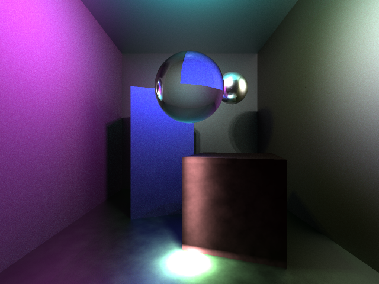

# Raytracer
Raytracer made for 3rd year graphics project. 

Features include:

  + Simple OpenMP parallelisation
  + Multiple Lights
  + Anti-aliasing
  + Smooth Shadows
  + Ambient, diffuse, specular materials (Phong)
  + Reflective material (mirror)
  + Realistic refractive material with Fresnel equations (glass)
  + Diffuse Pathtracing, optimised with cosine sampling
  + Specular Pathtracing, by cosine sampling along reflected ray
  + Photon mapping for caustics, optimised with KD-tree

Building requires GLM library in parent folder. See Makefile.

----
## Render 
----

